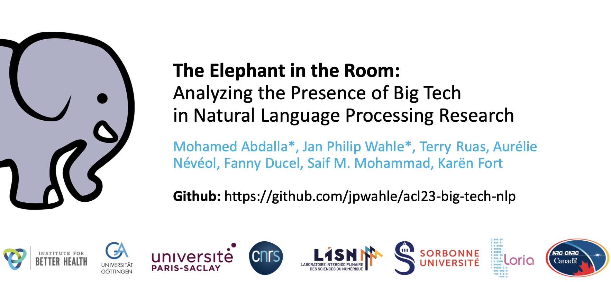

# The Elephant in the Room: Analyzing the Presence of Big Tech in Natural Language Processing Research
[](arxiv.org/abs/2305.02797)
[](https://opensource.org/licenses/Apache-2.0)

This repository contains the code and data for the ACL 2023 paper [The Elephant in the Room: Analyzing the Presence of Big Tech in Natural Language Processing Research](arxiv.org/abs/2305.02797).


[](./teaser.png)


## Data
If you want to use our preprocessed data, consider `data/processed_data.zip`.

To reproduce the data for later years, you will need to download the `anthology.bib` from the [ACL Anthology](https://aclanthology.org) and place it in the `data` folder.

You can find the list of universities [here](https://www.topuniversities.com/qs-world-university-rankings) and an export of big tech companies [here](https://finviz.com).

To reproduce the dataset, you can use the notebook `notebooks/datasets.ipynb`.

### Analysis
For running parts of the analysis of the paper, you can use the notebook `notebooks/analysis.ipynb`.

## How to Cite

```tex
@article{abdalla2023elephant,
	title        = {The elephant in the room: Analyzing the presence of big tech in natural language processing research},
	author       = {Abdalla, Mohamed and Wahle, Jan Philip and Ruas, Terry and N{\'e}v{\'e}ol, Aur{\'e}lie and Ducel, Fanny and Mohammad, Saif M and Fort, Kar{\"e}n},
	year         = 2023,
	month        = jul,
	booktitle    = {Proceedings of the 61st Annual Meeting of the Association for Computational Linguistics (Volume 1: Long Papers)},
	publisher    = {Association for Computational Linguistics},
	address      = {Toronto, Canada}
}
```
